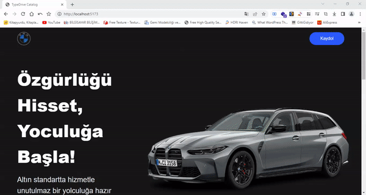

# Araç Kataloğu React Projesi

Bu React projesi, bir araç kataloğunu görüntülemek ve filtrelemek için kullanılan bir web uygulamasını içerir. Proje, TypeScript kullanılarak geliştirilmiş ve Framer Motion animasyonları ile zenginleştirilmiştir.

## Özellikler

### TypeScript Entegrasyonu

- **Statiğe Tip Kontrolü:** TypeScript, projenin tüm bileşenlerinde ve fonksiyonlarında statiğe tip kontrolü sağlar. Bu sayede kodun daha güvenli ve hata ayıklamasının daha kolay olmasını sağlar.

- **Tip Tanımları:** Proje boyunca, veri yapılarının ve bileşenlerin tip tanımları yapılmıştır. Özellikle, veri tabanından alınan araçlar için `ICarProps` gibi özel türler kullanılmıştır.

- **Fonksiyon Parametreleri:** Fonksiyonlar, alınması gereken parametrelerin türleri ile belirtilmiştir. Örneğin, bir filtreleme işlevi aşağıdaki gibi tanımlanmıştır:

    ```typescript
    function filterCarsByYear(year: number): ICarProps[] {
      // ...
    }
    ```

### Framer Motion Animasyonları

- **Resim Animasyonları:** Projede Framer Motion kütüphanesi kullanılarak resimler üzerinde çeşitli animasyonlar uygulanmıştır. Örneğin, resimlerin yavaşça yüklendiği veya modal penceresinin animasyonlarla açıldığı görülebilir.

### Veri Tabanı Entegrasyonu

- **Veri Çekme İşlemi:** Projede, bir veri tabanından araç bilgileri çekme işlemi yapılmıştır. Bu işlem, verilerin nasıl getirileceği ve nasıl işleneceği konularında TypeScript ile güvence altına alınmıştır.

### Filtreleme ve Arama

- **Arama ve Filtreleme:** Kullanıcılar, araçları marka, model, yıl ve yakıt tipine göre arayabilir ve filtreleyebilirler. TypeScript ile filtreleme işlemleri ve kullanıcı girişi doğrulamaları yapılmıştır.

## Teknolojiler

- **React:** Kullanıcı arayüzünü oluşturmak için.
- **TypeScript:** Projede statik tip kontrolü için.
- **Framer Motion:** Animasyonlar için.
- **Veri Tabanı:** Araç verilerini saklamak için.

[Canlı Önizleme](https://typedrive-catalog.netlify.app)




    

